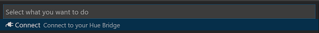
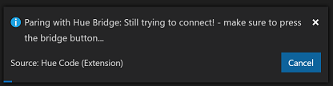
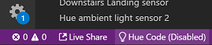
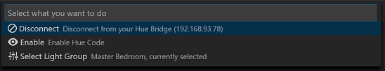
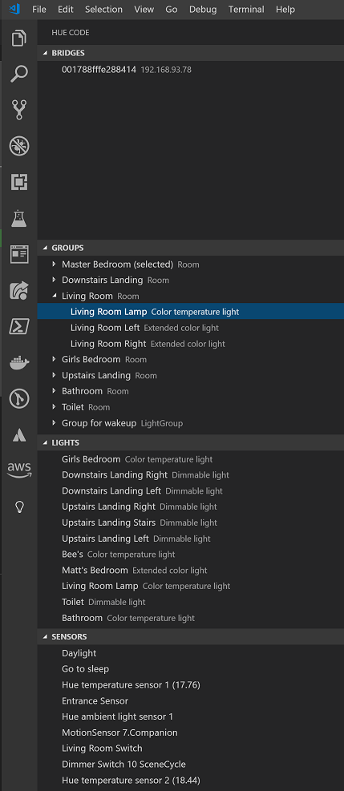

# Hue Code

Make your [Hue smart lights](https://amzn.to/2MC3RVD) come to life as you code! Your room will pulse as you enter debug mode; as you switch text files your room will flash. With Hue Code, you will feel like you are in a Hollywood hacking movie writing an epic multi-headed hydra virus! It also happens to have some great features for exploring your hue network.

## Events

The following events will change your hue lights:

| Event                          | Lights      |
| ------------------------------ | ----------- |
| `Change Active Text Editor`    | Flash White |
| `Debug Session`                | Pulse Red   |
| `Open Terminal`                | Flash Green |
| `Close Terminal`               | Flash Red   |
| `Change Breakpoint`            | Flash Blue  |
| `Enabled`                      | Flash Twice Blue |
| `Disabled`                     | Flash Twice Red |

You can expect to see more along the way soon.

## Pair Hue Bridge

After you install the plug, you will need to pair your bridge. To do this, first select the status bar menu item.

This will display the Hue Code menu and give you the option of connecting to you Hue Bridge.

The discovery of your bridge is fully automatic, but you will need to go and press the button on the top of your bridge when the following progress window appears:

## Sync Lights

By default, Hue Code will not sync your lights. To enable light sync, first select the status bar menu item.

And then enable Hue Code. You can select a different light group at any time.

## View Hue Resources

You can also view your hue lights, groups, sensors and bridges in the tree view. Handy tip: you can view the temperature of your motion sensors.

